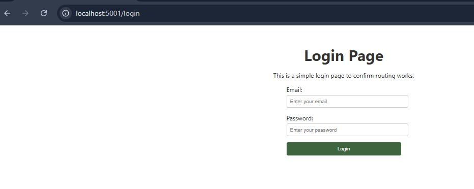
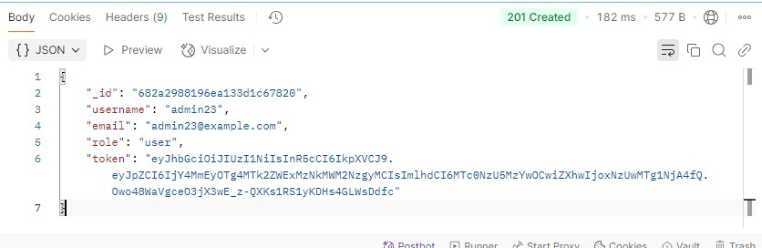

# Laiba's React Portfolio

A modern, full-stack portfolio website with a React frontend and Node.js/Express backend, featuring a clean UI, component-based architecture, and secure API endpoints.

## Features

- **Responsive Design**: Adapts seamlessly to desktop and mobile
- **Interactive UI**: Animated skill bars, project cards with hover effects
- **Component-Based Architecture**: Reusable components for maintainability
- **Form Validation**: Contact form with detailed validation feedback
- **Context API**: Dynamic page title updates and authentication state management
- **REST API Integration**: Backend API for dynamic content
- **JWT Authentication**: Secure admin access for content management
- **Role-Based Access Control**: Admin-only protected routes
- **Admin Dashboard**: Full content management interface
- **MongoDB Database**: Persistent storage for all portfolio content

## Technologies Used

### Frontend
- React 18+
- React Router DOM v6
- CSS Modules
- Axios
- Context API
- JWT for authentication

### Backend
- Node.js
- Express.js
- MongoDB with Mongoose
- JSON Web Tokens (JWT)
- express-validator
- bcryptjs

## Project Structure

```
project/
├── React-Portfolio-2025/   # Frontend React application
│   ├── public/              # Static files and local JSON
│   ├── src/
│   │   ├── assets/          # Images and static assets
│   │   ├── components/      # React components
│   │   │   ├── Admin/       # Admin dashboard components
│   │   │   ├── Login/       # Authentication components
│   │   │   └── ProtectedRoute/ # Auth protection components
│   │   ├── context/         # Context providers including AuthContext
│   │   ├── hooks/           # Custom React hooks
│   │   ├── pages/           # Page components
│   │   │   ├── AdminPage/   # Admin dashboard page
│   │   │   └── Login/       # Login page
│   │   ├── services/        # API service modules
│   │   └── App.js           # Root component
│   └── package.json         # Frontend dependencies
│
└── server/                  # Backend API server
    ├── controllers/         # Request handlers
    ├── middleware/          # Auth and validation middleware
    ├── models/              # Mongoose data models
    ├── routes/              # API route definitions
    ├── server.js            # Express app entry point
    └── package.json         # Backend dependencies
```

## Installation and Setup

### Frontend

1. Navigate to the frontend directory:

```bash
cd React-Portfolio-2025
```

2. Install dependencies:

```bash
npm install
```

3. Start the development server:

```bash
npm start
```

4. Open [http://localhost:5001](http://localhost:5001) to view it in your browser.

### Backend

1. Navigate to the backend directory:

```bash
cd server
```

2. Install dependencies:

```bash
npm install
```

3. Create a `.env` file with the following variables:

```
MONGODB_URI=mongodb://localhost:27017/portfolio
PORT=5000
JWT_SECRET=your_secret_key
```

4. Start the server:

```bash
npm run dev
```

5. API will be available at [http://localhost:5000](http://localhost:5000)

## Key Features

### Frontend Components

- **Responsive Navigation and Sidebar**
  - Collapsible sidebar on mobile
  - Fixed navigation with smooth scrolling

  
  

- **Project Showcase**
  - Uses reusable Card component
  - Hover animations and image zoom effects

  

- **Education Table**
  - Striped rows for better readability
  - Custom styling for different content types
    

- **Skills Visualization**
  - Animated progress bars using CSS animations
  - Triggered by Intersection Observer for better performance
    

- **Contact Form**
  - Client-side validation with error messages
  - Success alerts
    

- **Footer**
  - Footer with name
  - Appears when scrolled down
    

- **Light/Dark Mode**
  - toggles light/dark mode
    
    

- **Admin Dashboard**
  - Secure login with JWT authentication
  - Content management interface
  - Role-based access control
  - Protected routes for admin-only access
  - CRUD operations for all portfolio sections
   

### Backend API Features

- **RESTful API**: Full CRUD operations for education, skills, projects, and experience
- **JWT Authentication**: Secure endpoints for content management
- **Role-Based Access**: Admin-only routes for content modifications
- **Input Validation**: Request validation for all data inputs
- **Error Handling**: Comprehensive error responses
- **Local Data Fallback**: Graceful degradation when API is unavailable

## Authentication

The application includes comprehensive authentication and authorization features:
- JWT-based authentication with localStorage token storage
 
- User login with email and password
- Role-based access control (admin vs regular users)
- Protected routes with automatic redirects for unauthorized access
- Secure password handling with bcrypt hashing
- Logout functionality with proper token cleanup
- Context-based authentication state management

## Admin Dashboard

The admin dashboard provides a complete content management interface:
- Protected by authentication and role-based authorization
- Comprehensive management of education entries
- Skills management interface
- Project portfolio management
- Work experience management
- User-friendly forms for content creation and editing
- Intuitive table-based content listing
- Convenient logout button in top-right corner

## Best Practices Implemented

- **CSS Modules**: Scoped styling to avoid global CSS conflicts
- **Context API**: Smart state management for page titles and authentication
- **Functional Components**: Modern React patterns with hooks
- **Responsive Design**: Mobile-first approach with media queries
- **Component Reusability**: DRY principles with shared components
- **API Service Layer**: Centralized API communication
- **Environment Variables**: Separate configuration for development and production
- **Input Validation**: Server-side validation for all data
- **Secure Authentication**: JWT with proper storage and handling
- **Protected Routes**: Route-based access control

## License

This project is open-source and available under the MIT License.
