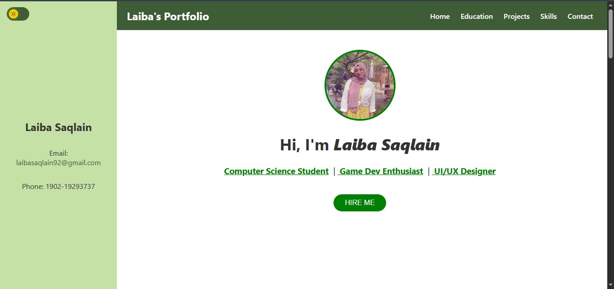
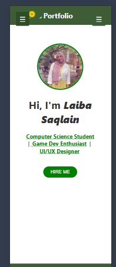
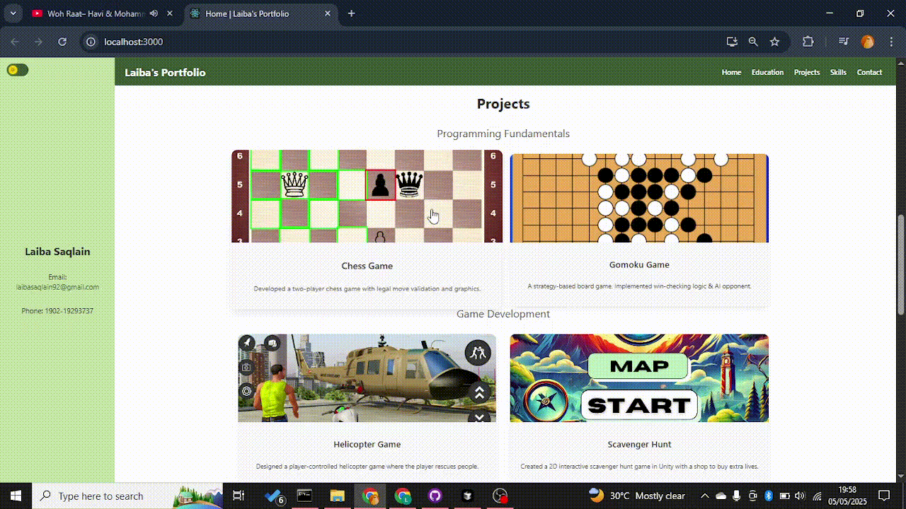
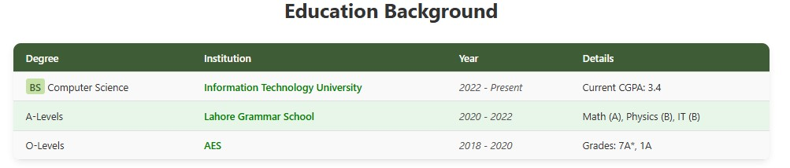
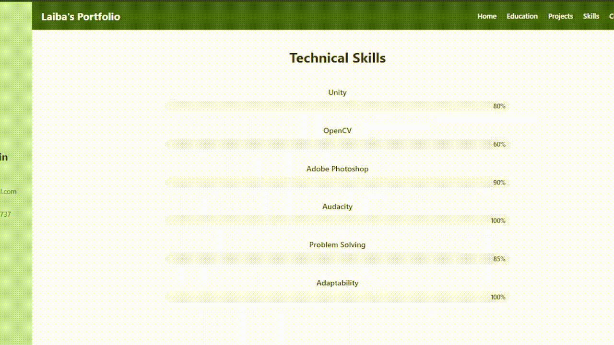
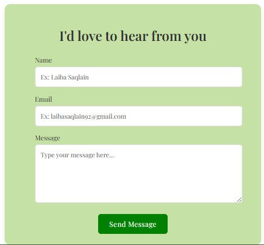
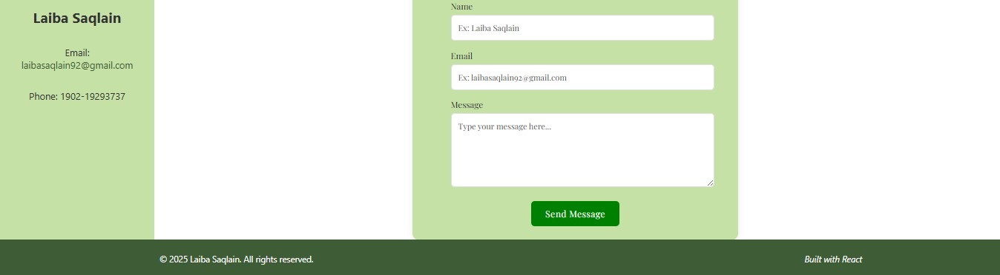
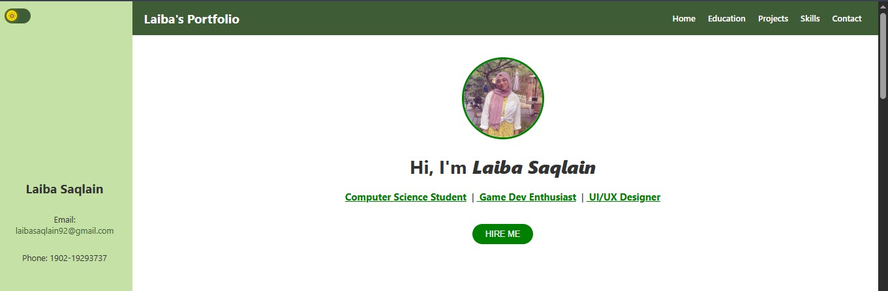
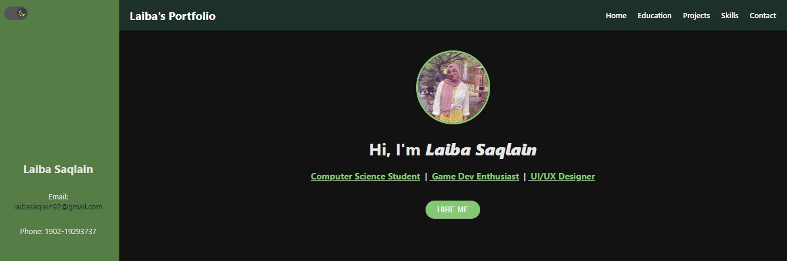

# Laiba's React Portfolio

A modern, responsive portfolio website built with React, featuring a clean UI and a component-based architecture.

## Features

- **Responsive Design**: Adapts seamlessly to desktop and mobile
- **Interactive UI**: Animated skill bars, project cards with hover effects
- **Component-Based Architecture**: Reusable components for maintainability
- **Form Validation**: Contact form with detailed validation feedback
- **Context API**: Dynamic page title updates

## Technologies Used

- React 18+
- React Router DOM v6
- CSS Modules
- Intersection Observer API
- Context API

## Project Structure

```
src/
├── assets/               # Images and static assets
├── components/
│   ├── common/           # Reusable components
│   │   └── Card/         # Reusable card component with CSS module
│   ├── Contact/          # Contact section with form validation
│   ├── Education/        # Education section with custom table
│   ├── Footer/           # Fixed footer component
│   ├── Home/             # Main home page with sidebar and hero section
│   ├── Projects/         # Projects showcase using Card components
│   └── Skills/           # Skills section with animated progress bars
├── context/
│   └── PageTitleContext.js # Context for dynamic page titles
├── pages/
│   └── HomePage.jsx      # Main page structure with all sections
└── App.js                # Root component with providers
```

## Installation and Setup

1. Clone the repository:

```bash
git clone https://github.com/yourusername/react-portfolio.git
cd react-portfolio
```

2. Install dependencies:

```bash
npm install
```

3. Start the development server:

```bash
npm start
```

4. Open [http://localhost:3000](http://localhost:3000) to view it in your browser.

## Key Components

### Responsive Navigation and Sidebar

- Collapsible sidebar on mobile
- Fixed navigation with smooth scrolling




### Project Showcase

- Uses reusable Card component
- Hover animations and image zoom effects



### Education Table

- Striped rows for better readability
- Custom styling for different content types
  

### Skills Visualization

- Animated progress bars using CSS animations
- Triggered by Intersection Observer for better performance
  

### Contact Form

- Client-side validation with error messages
- Success alerts
  

### Footer

- Footer with name
- Appears when scrolled down
  

### Light/Dark Mode

- toggles light/dark mode
  
  

## Best Practices Implemented

- **CSS Modules**: Scoped styling to avoid global CSS conflicts
- **Context API**: Smart state management for page titles
- **Functional Components**: Modern React patterns with hooks
- **Responsive Design**: Mobile-first approach with media queries
- **Component Reusability**: DRY principles with shared components
- **Accessibility**: Semantic HTML elements and proper ARIA attributes

## License

This project is open-source and available under the MIT License.
